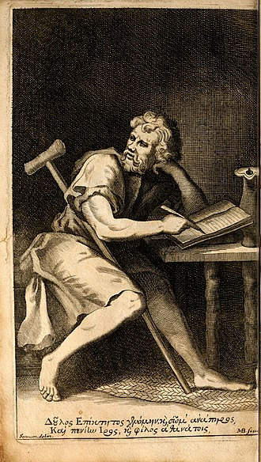
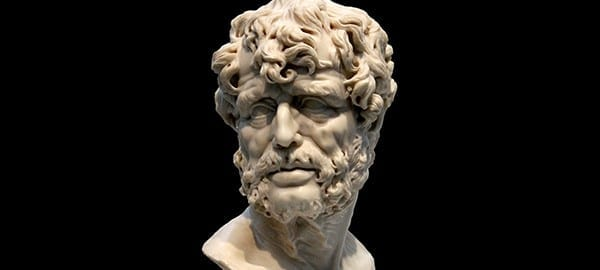

# Introudction to Stoicism 

Stoicism is the personal practice of growth, fulfillment, learning, action, and freedom. 
It teaches you to grow and become the best version of yourself, to become a better person and a good individual.
Through discipline and continuous practice, you work on yourself and strive towards a better soul, mind, and body.
Central to Stoicism is the pursuit of virtue and wisdom, recognizing the importance of distinguishing between what is within our control and what is not.
Stoics emphasize rationality, resilience, and the acceptance of fate, aiming to maintain tranquility and inner peace regardless of external circumstances.

## Origins

Stoicism was founded in Athens by Zeno of Citium around 300 BC.

## History

Since 300 BC, there have been many famous Stoic philosophers embodying the common traits and practices associated with the philosophy, along with many other branches inspired by it.

Here are a few of the most famous or well-recognized people:

### Marcus Aurelius

Marcus Aurelius Antoninus was Roman emperor from 161 to 180 and a Stoic philosopher. 
He is the most widely known Stoic philosopher, and his works, Meditations, have been his most influential pieces of work. 
They were his personal diary entries to himself, reminding him to be better, reflect, practice, and embody his principles and philosophy every day.

### Epictetus

Epictetus was an exponent of Stoicism who flourished in the early second century C.E. about four hundred years after the Stoic school of Zeno of Citium was established in Athens.
He lived and worked, first as a student in Rome, and then as a teacher with his own school in Nicopolis in Greece. His original name is not known; epiktētos is the Greek word meaning “acquired.” 
As a boy he was a slave but managed to attend lectures by the Stoic Musonius Rufus. He later became a freedman and lived in ill health, but still embodying the stoic philosophy and principles.
Teaching people regardless of ones circumstances you could live a true and happy life.

### Seneca

Lucius Annaeus Seneca, known simply as Seneca (or Seneca the Younger), was a stoic philosopher and rhetorician.
He's one of the first stoics for which there are considerable literary remains for us to study. Born over 2,000 years ago in Spain as the son of Seneca the Elder
Seneca agrees with the Stoics that virtue is sufficient for happiness. One's virtue, unlike one's circumstances, is within one's power. 
Knowledge of one's nature is importantly connected, in Stoicism, with one's knowledge of nature generally. 
Seneca often appeals to the importance of understanding nature in his works most notable Letters from a stoic, to which he writes to his friend and emphasizes the lessons
of Stoicism in his daily life.

### Diogenes

Diogenes, also known as Diogenes the Cynic or Diogenes of Sinope, was a Greek philosopher and one of the founders of Cynicism. He was born in Sinope, an Ionian colony on the Black Sea coast of Anatolia, in 412 or 404 BC and died at Corinth in 323 BC.
Cynicism came to be seen as an idealised form of Stoicism, a view which led Epictetus to eulogise the ideal Cynic in a lengthy discourse, Diogenes lived his life with little and embodying both the Cynicism and Stoicism principles truly in his daily life.

