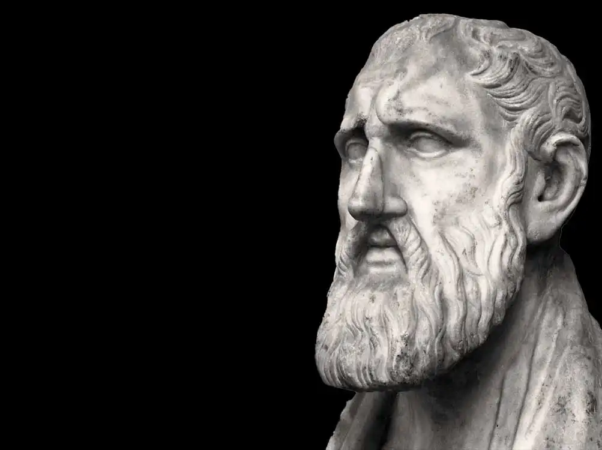
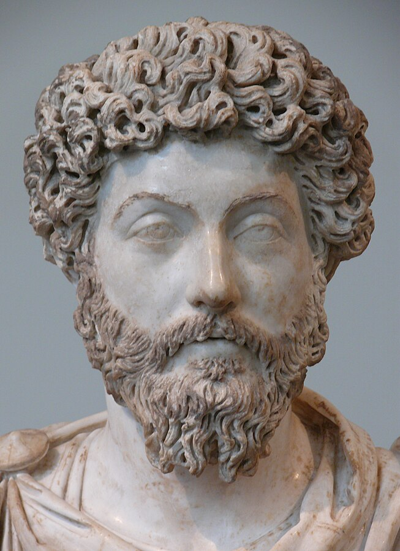

# Introudction to Stoicism 

Stoicism is the personal practice of growth, fulfillment, learning, action, and freedom. 
It teaches you to grow and become the best version of yourself, to become a better person and a good individual.
Through discipline and continuous practice, you work on yourself and strive towards a better soul, mind, and body.
Central to Stoicism is the pursuit of virtue and wisdom, recognizing the importance of distinguishing between what is within our control and what is not.
Stoics emphasize rationality, resilience, and the acceptance of fate, aiming to maintain tranquility and inner peace regardless of external circumstances.

## Origins

Stoicism was founded in Athens by Zeno of Citium around 300 BC.

## History

Since 300 BC, there have been many famous Stoic philosophers embodying the common traits and practices associated with the philosophy, along with many other branches inspired by it.

Here are a few of the most famous or well-recognized people:

### Marcus Aurelius

Marcus Aurelius Antoninus was Roman emperor from 161 to 180 and a Stoic philosopher. 
He is the most widely known Stoic philosopher, and his works, Meditations, have been his most influential pieces of work. 
They were his personal diary entries to himself, reminding him to be better, reflect, practice, and embody his principles and philosophy every day.

